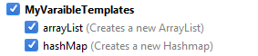
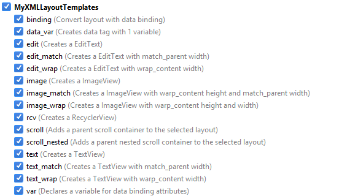

# Android Studio Live Templates

Collection of my personal Live Templates for Android Studio / Intellij IDEA.

> Be Lazy. Be Productive.

## Installation

Download or clone this repository and copy all the files inside `templates` directory to your AndroidStudio's `config/templates` folder

For more details check this link for config folder depending on your OS: [https://www.jetbrains.com/help/idea/2017.1/sharing-live-templates.html#config_file_location](https://www.jetbrains.com/help/idea/2017.1/sharing-live-templates.html#config_file_location)

Note: If you are using Android Studio, then you will find AndroidStudio folder name instead of `IntelliJ IDEA`

Restart and done! #Awesome

## Usage

Here is the list of codes available, try them out!

Many of the templates uses data binding for faster development.

### Android Templates

### Variables Templates

### XML Layout Templates

### Kotlin Templates

Currently following live templates are supported for Kotlin which we are used to in Java

* todo
* fixme
* Toast
* logd
* logi
* loge
* logr
* logt
* logw
* wtf
* fori
* itar
* iter

Have an idea or live template which can be useful? Share it by creating an issue or submitting a pull request.

## Using Studio Templates

Copy the folders inside `studio_templates` to `~/.android/templates/other` (Ref: https://issuetracker.google.com/issues/37105193) 

Currently available templates:

* New Activity with databinding (auto-enable databinding)
* Add dependecies on the fly
